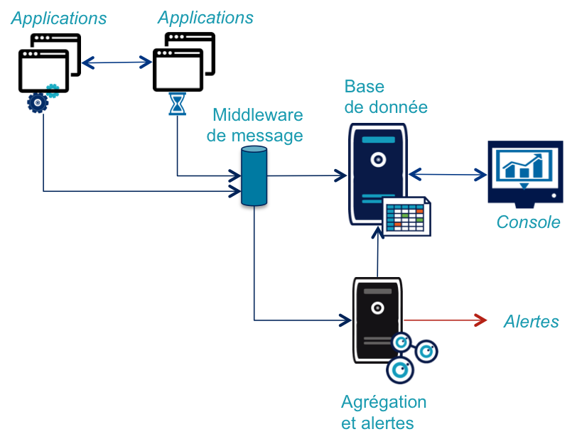
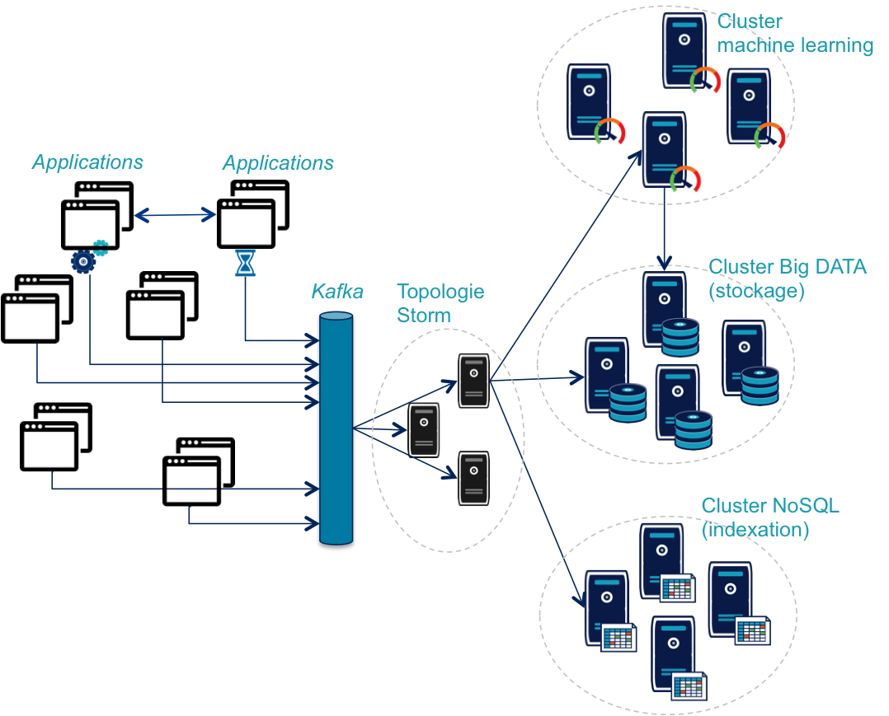

# Présent et avenir du monitoring de flux 

Avoir un monitoring de flux performant est critique: intégrant tous les flux de données il est à même d'offrir une vision synthétique de tous le système d'information.

L'objectif de cet article est de vous permettre de comparer votre système actuel avec les bonnes pratiques généralement observées et de vous donner des pistes d'évolutions.

# Monitoring de flux ?

On appelle un *flux* un **ensemble d'appels de services et d'envois de messages qui ensemble forment un service métier**. Dans un système d'information complexe, un tel flux traverse souvent plusieurs applications et utilise parfois plusieurs technologies : par exemple un utilisateur clique sur un écran qui déclenche un appel REST qui provoque une invocation SOAP dont le traitement envoie une série de messages JMS.

Monitorer ces flux signifie donc mettre en place un monitoring des activités métier *(Business Activity Monitor)*. Cela consiste à collecter des données dans toutes les couches applicatives pour les corréler. Cela permet d'obtenir **une vision transverse agrégée** de l'activité de votre système d'information. Ce monitoring doit fournir à tout moment **l'état de santé et la performance des fonctions métiers importantes** *(Key Performance Indicator)*.

Dans la suite de l'article un message métier indiquera indifférement le contenu d'un appel de service ou d'un message envoyé.

## Pour avoir un bon monitoring de flux

### Fonctionnalités

La fonctionnalité essentielle est d'être capable d'**identifier les flux métier** dans les messages atomiques. Généralement cela passe par l'utilisation d'un identifiant unique (*correlation id*). Tous les messages d'un même flux devront donc contenir le même identifiant. Cela passe par la mise en place d'une brique spécifique dans les différents applicatifs chargée de générer l'identifiant en début de chaîne et de le propager dans les traitements. Cette brique sera aussi responsable de transmettre une copie des messages pour qu'elle soit intégrée dans le monitoring.

Le système doit être capable de prendre en compte **des évènements hétérogènes** : si les messages envoyés par les différents composants comportent des éléments communs (horodatage par exemple) ils comportent aussi des informations spécifiques liées au métier du service (nom du service métier, identifiant d'objets). Être capable d'intégrer facilement ces différentes données permettra de construire au plus juste des métriques fonctionnelles qui évolueront en même temps que les services.

Pour pouvoir exploiter ces données il faut disposer d'un système de **dashboarding configurable** : il ne s'agit pas seulement de prédéfinir un ensemble d'écrans de monitoring fixes, mais aussi de pouvoir s'en servir pour des études ou des investigations. Cela signifie qu'une fois mis en place, il doit être configurable dynamiquement pour pouvoir modifier des écrans ou en créer de nouveaux. Les systèmes de monitoring utilisés habituellement, lourds et fermés sont donc mal adaptés à ce type d'usage.

La base de donnée doit fournir des fonctionnalités d'**indexation** avec une couverture maximum, l'idéal étant d'indexer l'intégralité des champs des données. Cela permet de simplifier les investigations en cas d'erreur : on pourra par exemple identifier tous les messages qui concernent un certain numéro de compte. Pour des questions de volume, on pourra limiter l'indexation dans le temps (48 heures au moins), en gardant la possibilité de réindexer des messages passés.

### Contraintes

#### Ne jamais interférer avec le métier

Un échec dans la brique de monitoring ne doit **jamais entrainer de conséquences sur le fonctionnel**, il faut donc bien isoler techniquement les deux.

Ensuite le monitoring ne doit **pas entrainer de baisse de performances**, les messages de monitoring doivent être envoyées sous forme d'évènements asynchrones (pattern *[wiretap](http://www.enterpriseintegrationpatterns.com/WireTap.html)*) à l'aide d'un middleware de messages. Il est souhaitable d'avoir une infrastructure de message dédiée, car on évite ainsi tout risque de surcharge.

#### Limiter les développements spécifiques

Enfin il faut **Limiter les développement métier dans les briques de monitoring**: si de la configuration ou un peu de développement spécifique est inévitable, surtout pour les métriques les plus précises, il faut éviter de recoder des comportement fonctionnels. Cela se produit souvent quand on veut s'appuyer sur les messages de monitoring pour reproduire l'état du système monitoré. Le résultat est souvent fragile et va rendre plus difficile les évolutions du métier.

### Briques logicielles nécessaires

Pour répondre à ces critères, on peut donc identifier les différentes briques qui sont nécessaires pour le monitoring de flux :
- Les informations sont transmises sous formes d'événements dans un middleware de message dédié.
- Un système de traitement de messages pour faire des agrégations et de la détection d'évènements.
- Une base de donnée indexée où ils sont stockés.
- Une console de monitoring pour les exploiter.

# Pratiques actuelles

Votre système d'information comporte déjà une partie des blocs techniques dont on a besoin, comme un système de messages ou une base de donnée. Malheuresement les spécificités du monitoring empêchent souvent d'utiliser les mêmes outils :

- Du fait du grand nombre de messages entrant dans le système, les middleware classiques n'offrent pas une capacité de traitement suffisante, il est donc nécessaire d'utiliser un **système de communication spécialisé** pour ce type de volume : [AMQP](http://www.amqp.org), [SNMP](http://en.wikipedia.org/wiki/Simple_Network_Management_Protocol), [RSYSLOG](http://www.rsyslog.com), [ZeroMQ)](http://zeromq.org.

- Pour le traitement de messages un système de **[CEP](http://en.wikipedia.org/wiki/Complex_event_processing)** (*complex event processing*) comme [Drool Fusion](http://docs.jboss.org/drools/release/latest/drools-docs/html/DroolsComplexEventProcessingChapter.html) va gérer les aspects techniques pour permettre de se concentrer sur les règles à mettre en place.

- La base de données doit stocker des messages ayant des formats hétérogènes et qui évoluent avec les applications. On s'orientera donc généralement vers une solution de stockage de type NoSQL permettant d'avoir des schémas de données dynamiques tout en fournissant partitionnement et scalabalité afin d'absorber le volume et le débit de données entrant. Les fonctionnalités d'indexation d'**[Elastic Search](http://www.elasticsearch.org)** en font généralement un bon choix.

- Pour le dashboarding [Kibana](http://www.elasticsearch.org/overview/kibana/) est le produit de référence pour visualiser des données stockées dans Elastic Search : il permet de construire des écrans riches de manière flexible.

# Le futur

Ce type d'architecture reposant sur des briques standard est limité sur deux aspects, le premier est technique et le second fonctionnel. 

## Toujours plus de messages

La première limite est liée à l'augmentation du nombre de messages à traiter. Dans des systèmes basés sur les nouvelles architectures de micro-services et qui intègrent de nouveaux usages (applications mobiles, internet des objets) le nombre de messages est démultiplié. L'objectif du système de monitoring étant de continuer à absorber l'intégralité des messages il doit voir ses capacités augmenter dans les mêmes proportions.

Cela entraine la mise en place de plusieurs solutions :
- Même en choisissant un broker rapide, les solutions de middleware de messages classiques plafonnent à 10 000 messages par seconde. Il faut alors se tourner vers des solutions **«Fast Data»** dont [Kafka](http://kafka.apache.org) semble aujourd'hui devenir la solution de référence.
- L'intégration de messages dans le système de stockage doit passer par une solution d' **« Event Streaming »**. Les solutions envisageables sont [Apache Storm](https://storm.apache.org) et [Apache Spark Streaming](https://spark.apache.org/streaming/).
- Le stockage d'un tel volume de données sera réalisé sur **un système de stockage distribué** comme une [Apache Cassandra](http://cassandra.apache.org) ou [HDFS](http://hadoop.apache.org/docs/r1.2.1/hdfs_design.html#Introduction) d'Hadoop. Le stockage dans Elastic Search pourra être conservé pour des besoins de requêtage rapide sur des données récentes.

Ce type d'architecture "big data" permettant un traitement en flux porte le nom de [DataLake](http://www.forbes.com/sites/ciocentral/2011/07/21/big-data-requires-a-big-new-architecture/)

## Des analyses plus poussées

Après les moteurs de règles classiques, on commence à se tourner vers des solutions d'analyse plus pointues permettant de mieux mesurer ce qui se passe mais aussi de mieux prévoir. Dans cette optique la composante métier du monitoring prend de plus en plus de poids et la distinction avec la BI s'efface et nous sommes convaincus qu'on verra bientôt des solutions d'*online machine learning* enrichir ces systèmes.

